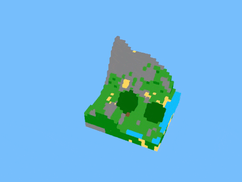
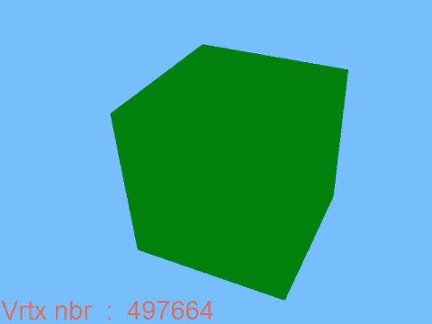
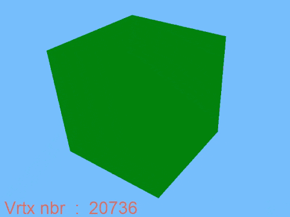
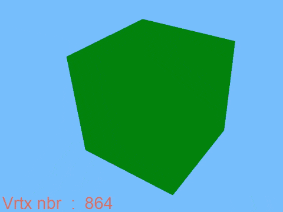

# Minecraft Clone - OpenGL Learning Project

This project is a simplified Minecraft clone developed in 2018 as part of my learning journey in 3D graphics programming with OpenGL.  
It is an educational project that allowed me to explore the fundamentals of 3D rendering, shader programming, procedural generation, and performance optimization.





## 🎯 Project Goals

- Learn OpenGL and GLSL shaders
- Implement a chunk system similar to Minecraft
- Discover procedural terrain generation
- Optimize 3D rendering
- Implement a first-person camera system

## 🛠️ Technologies Used

- **C++**: Main programming language
- **OpenGL**: Graphics API
- **GLFW**: Window and input management
- **GLM**: 3D mathematics
- **FreeType**: Text rendering
- **CMake**: Build system

## 🏗️ Technical Architecture

### 3D Rendering
- Custom shaders
- Textures
- First-person camera
- Rendering optimization
- Use of Vertex Buffer Objects (VBO) and Vertex Array Objects (VAO) for efficient GPU data management
- Backface culling enabled to avoid drawing hidden triangle faces

### Chunk System
- Chunk size and world size are fully configurable (default: chunk 16x16x16, world 48x2x48)
- Chunk-based rendering: only active chunks are updated and rendered, improving performance

### Procedural Generation
- Perlin noise
- Terrain generation with sea level
- Multiple block types

## 🚀 Build Instructions

```bash
mkdir build
cd build
cmake ..
make
```

## 🛠️ Optimization

In voxel-based engines, naive rendering of every cube face quickly leads to excessive vertices and draw calls. Optimizations like face culling and vertex merging drastically reduce vertex count and improve performance.  
The GIFs below show their impact on a 24×24 cube structure.

A large cube made of 24×24 unit cubes. Vertex count: 497,664.



With occlusion culling, hidden faces are removed -> Vertex count: 20,736.



With vertex merging, adjacent vertices are merged -> Vertex count: 864.



### Other optimizations implemented

- **Backface culling**: OpenGL is configured to not render the back faces of triangles, reducing unnecessary fragment processing.
- **Chunk-based rendering**: The world is divided into chunks, and only the necessary chunks are updated and rendered each frame, improving scalability.
- **Frame update limitation**: The number of chunk updates per frame is limited to avoid performance spikes and ensure smooth rendering.
- **VBO/VAO usage**: All geometry data is stored in GPU-optimized buffers (Vertex Buffer Objects and Vertex Array Objects) for fast and efficient rendering.


## 🕰️ Project Retrospective

Old codebase, with many awkward or improvable parts, but still interesting, especially for the diversity of topics covered. This project was developed in 2018; this brief review was written in 2025.

### 🔮 What I would improve today
- Refactor and modernize the codebase using C++20 features
- Improve memory management (smart pointers, RAII)
- Separate engine and game logic more clearly
- Implement missing features (e.g., tree generation, more block types)
- Optimize rendering further (instancing, frustum culling, ...)
- Code quality:
  - No error handling
  - Hardcoded values & magic numbers
  - Hardcoded absolute paths
  - Use of non-descriptive or placeholder variable names
  - Some monolithic code structures
  - Use of global variables
  - Duplicated code / copy-paste blocks
  - Inconsistent naming conventions
  - Manual memory management (use of new/delete)
  - Dead code or commented-out code
  - Tight coupling between components
  - Lack of modularity / separation of concerns

### 🤔 What I Learned

- 3D graphics programming with OpenGL
- Performance optimization in a 3D context
- Procedural content generation
- Memory management in C++
- Using CMake for project management
